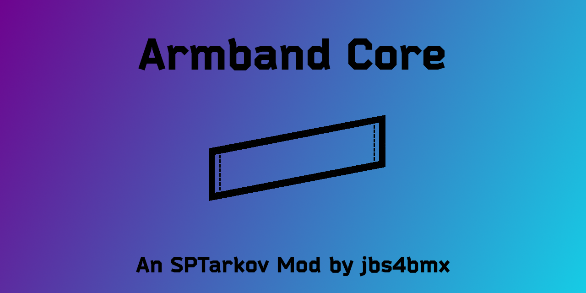

[![Contributors][contributors-shield]][contributors-url]
[![Forks][forks-shield]][forks-url]
[![Stargazers][stars-shield]][stars-url]
[![Issues][issues-shield]][issues-url]
[![MIT License][license-shield]][license-url]

<!-- PROJECT LOGO -->
 

  

  <h3 align="center">Armband Core</h3>

  
Core component needed for armband to function as armor equipment. 

  

<!-- TABLE OF CONTENTS -->

  
Table of Contents

  <ol>
    <li>
      <a href="#about-the-project">About The Project</a>
      <ul>
        <li><a href="#built-with">Built With</a></li>
      </ul>
    </li>
    <li>
      <a href="#getting-started">Getting Started</a>
      <ul>
        <li><a href="#prerequisitesforbuilding">Prerequisites for Building</a></li>
        <li><a href="#installation">Installation</a></li>
      </ul>
    </li>
    <li><a href="#configuration">Configuration</a></li>
    <li><a href="#roadmap">Roadmap</a></li>
    <li><a href="#contributing">Contributing</a></li>
    <li><a href="#license">License</a></li>
    <li><a href="#acknowledgments">Acknowledgments</a></li>
  </ol>

<!-- ABOUT THE PROJECT -->
## About The Project
Type: Client Mod 
Disclaimer: **This mod is provided _as-is_ with _no guarantee_ of support.**

This alters the armband slot ["EquipmentSlot ArmorSlot" method] in the EFT client to allow armbands to function as armor. Without this, armbands can have the properties of armor, but will not provide the protection.

You can give armbands armor properties, include this mod as a pre-requisite installation, and shield yourself without taking up inventory space or adding additional weight to your PMC.

This mod can be used by anyone that wants to include altered armbands in their mod/modpack; just specify this mod as a dependency. You don't need to maintain additional code as I'll do it for you with this mod.

(<a href="#readme-top">back to top</a>)

### Built With
| Frameworks/Libraries                                      | Name         | Link                                       |
| :-------------------------------------------------------: | :----------: | :----------------------------------------: |
|               | `C Sharp`    | [C# Documentation][CSharp-url]             |

|                         IDEs                                |      Name       | Link                                      |
| :---------------------------------------------------------: | :-------------: | :---------------------------------------: |
|  | `Visual Studio` | [Visual Studio Website][VisualStudio-url] |

(<a href="#readme-top">back to top</a>)

<!-- GETTING STARTED -->
## Getting Started
_For the purpose of these directions, "[SPT]" represents your SPT folder path._

This is an example of how you may give instructions on setting up your project locally.
To get a local copy up and running follow these simple example steps.

### Prerequisites for Building
  1. Visual Studio or another compiler of your choosing.
  2. The following assembly files need to be referenced within the project:
     - Assembly-CSharp.dll - Find in "[SPT]\EscapeFromTarkov_Data\Managed".
     - spt-common.dll - Part of the SPT modules for the launcher. Find in "[SPT]\BepInEx\plugins\spt".
     - BepInEx.dll - Part of the BepInEx Harmony Patcher. Find in "[SPT]\BepInEx\core"

### Installation
Extract the contents of the zip file into the root of your [SPT] folder.
  - That's the same location as "SPT.Server.exe" and "SPT.Launcher.exe".

(<a href="#readme-top">back to top</a>)

<!-- CONFIGURATION EXAMPLES -->
## Configuration
There are no configuration options for this mod.

(<a href="#readme-top">back to top</a>)

<!-- ROADMAP -->
## Roadmap

- [X] Implement armband slot as equipment slot armor slot.

Suggest changes or view/report issues [here](https://github.com/jbs4bmx/ArmbandCore/issues).

(<a href="#readme-top">back to top</a>)

<!-- CONTRIBUTING -->
## Contributing

Contributions are what make the open source community such an amazing place to learn, inspire, and create. Any contributions you make are **greatly appreciated**.

If you have a suggestion that would make this better, please fork the repo and create a pull request. You can also simply open an issue with the tag "enhancement".
Don't forget to give the project a star! Thanks again!

1. Fork the Project
2. Create your Feature Branch (`git checkout -b feature/AmazingFeature`)
3. Commit your Changes (`git commit -m 'Add some AmazingFeature'`)
4. Push to the Branch (`git push origin feature/AmazingFeature`)
5. Open a Pull Request

You can also buy me a coffee! (This is not required, but I greatly appreciate any support provided.) 

(<a href="#readme-top">back to top</a>)

<!-- LICENSE -->
## License

Distributed under the MIT License. See `LICENSE.txt` for more information.

(<a href="#readme-top">back to top</a>)

<!-- ACKNOWLEDGMENTS -->
## Acknowledgments
None yet.

(<a href="#readme-top">back to top</a>)

<!-- Repository Metrics -->
[contributors-shield]: https://img.shields.io/github/contributors/jbs4bmx/ArmbandCore.svg?style=for-the-badge
[contributors-url]: https://github.com/jbs4bmx/ArmbandCore/graphs/contributors
[forks-shield]: https://img.shields.io/github/forks/jbs4bmx/ArmbandCore.svg?style=for-the-badge
[forks-url]: https://github.com/jbs4bmx/ArmbandCore/network/members
[stars-shield]: https://img.shields.io/github/stars/jbs4bmx/ArmbandCore.svg?style=for-the-badge
[stars-url]: https://github.com/jbs4bmx/ArmbandCore/stargazers
[issues-shield]: https://img.shields.io/github/issues/jbs4bmx/ArmbandCore.svg?style=for-the-badge
[issues-url]: https://github.com/jbs4bmx/ArmbandCore/issues
[license-shield]: https://img.shields.io/github/license/jbs4bmx/ArmbandCore.svg?style=for-the-badge
[license-url]: https://github.com/jbs4bmx/ArmbandCore/blob/master/LICENSE.txt

<!-- Framwork/Library URLs -->
[CSharp-url]: https://learn.microsoft.com/en-us/dotnet/csharp/
[VisualStudio-url]: https://visualstudio.microsoft.com/
